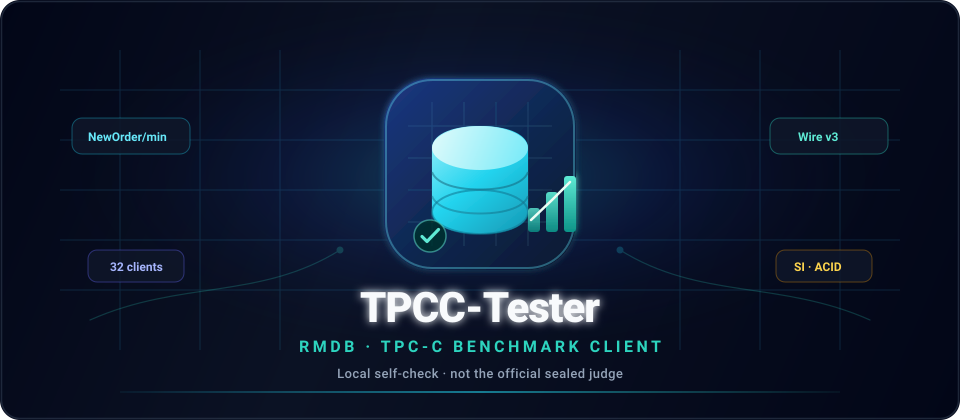

# TPCC-Tester

<p align="center">
  
</p>

<p align="center"><strong>TPCC-Tester</strong> — 面向 RMDB 的 TPC-C 风格本地评测客户端</p>

<p align="center">
  <a href="https://github.com/db-camp">db-camp</a> 维护 · Rust + tokio · 全国大学生计算机系统能力大赛 · 数据库管理系统设计赛
</p>

| 状态 | 说明 |
| --- | --- |
| **当前 `main` 可运行行为** | 传输层默认 **2026 Wire Protocol v3**（握手 + frame + `EXEC_STREAM` 类型化结果，#5）；负载仍为固定「线程 × 事务数」、tpmC 风格报告 |
| **旧协议兼容** | `--legacy-protocol` 切换回 2025 及更早的文本协议（逐条 SQL 文本、管道符结果解析） |
| **2026 决赛对齐** | **进行中**（社区贡献中）：`PREPARE_SET` / `EXEC_BATCH`（#6）、`SNAPSHOT ISOLATION`（#7）、热点饱和负载、`NewOrder/min` 等 |

> **不是**官方密封测评系统。正式成绩以组委会测评程序为准；本仓库用于本地自测与协议/事务回归。欢迎 PR。

---

## 文档与任务

| 文档 | 用途 |
| --- | --- |
| [`docs/architecture.md`](docs/architecture.md) | 2026 目标模块化架构（protocol / workload / txn / engine / …） |
| [`docs/2026年全国大学生计算机系统能力大赛数据库系统设计赛-决赛赛题.md`](docs/2026年全国大学生计算机系统能力大赛数据库系统设计赛-决赛赛题.md) | 2026 决赛赛题说明与 Wire Protocol |
| [Epic #4](https://github.com/db-camp/TPCC-Tester/issues/4) | 2026 对齐总任务与子 issue 索引 |
| [label:`2026-final`](https://github.com/db-camp/TPCC-Tester/issues?q=label%3A2026-final) | 全部相关 issue |

**架构一句话**：protocol 管字节，workload 管「测什么」，txn 管「怎么写库」，engine 管「多少人一起测」，report/check 管「算不算数」。

贡献 2026 功能时请对照架构文档分层落代码，并在 PR 中引用对应子 issue（建议 **P0 协议合入后再并行 P1**）。

---

## 环境与编译

```bash
# 安装 Rust（如未安装）
curl --proto '=https' --tlsv1.2 -sSf https://sh.rustup.rs | sh

cargo build --release
```

二进制：`./target/release/tpcc-tester`。

---

## 快速使用（当前 main）

需先启动可访问的 rmdb，默认 `127.0.0.1:8765`。默认走 **Wire Protocol v3**；连接 2025 旧文本协议的 rmdb 请在任意命令后追加 `--legacy-protocol`。

```bash
# 兼容性诊断（基础 SQL / 事务 / 聚合等）
./target/release/tpcc-tester --diagnose

# 初始化：生成 CSV + LOAD 导入（csv-path 必须是 rmdb 服务端可读路径）
./target/release/tpcc-tester --init --csv-path /tmp/tpcc_data -s 1

# 一致性检查（当前为简化 4 项，非 2026 完整在线校验）
./target/release/tpcc-tester --check -s 1

# 各表行数
./target/release/tpcc-tester --stats

# 并发基准（固定每线程事务数；指标为 TPS / tpmC，非官方 NewOrder/min）
./target/release/tpcc-tester --benchmark --threads 4 --transactions 100 -s 1
```

### 数据加载

`--init` 流程：

1. 按 scale factor 生成 9 张表的 CSV 到 `--csv-path`
2. 执行建表 / 建索引 SQL（`sql/`）
3. 对 rmdb 发送 `load <csv_path> into <table>`

`tpcc-tester` 与 rmdb 需同机或共享文件系统，保证服务端能打开 CSV 路径。

```bash
./target/release/tpcc-tester --init --csv-path /tmp/tpcc_data -s 5
```

CSV 会保留供反复性能测试，**不会在工具内自动清理**。

---

## 协议（Wire Protocol v3）

默认按赛题附件 A 实现 2026 传输层（`src/connection/protocol.rs` + `client.rs`）：

- 建连后 8 字节握手 `RMDB` + major=3 + minor=0，校验服务端原样回送；握手失败会提示尝试 `--legacy-protocol`
- 通用 8 字节 frame header（`u32 payload_bytes` / `u8 tag` / `u8 flags` / `u16 reserved`，大端序），循环 `read_exact` / `write_all`，payload 上限 1 MiB（先验长度再分配）
- `EXEC_STREAM` (0x20) 发送 UTF-8 SQL；查询按 `META → ROW* → RESULT_END` 解码并校验 `row_count`，非查询收 `COMMAND_OK`，失败收 `ERROR` / `TRANSACTION_ABORT`（诊断 ≤64 KiB）
- 类型化 cell：`INT32` / `FLOAT32`（IEEE-754 binary32 bit pattern，不经十进制文本）/ `CHAR`（长度前缀，无 padding）；`present` 仅 0/1
- 连接测活按规范执行精确语句 `show tables;`，`COMMAND_OK` 或 `META…RESULT_END`（含 0 行）均视为就绪
- 协议违规（非法 tag、非零 reserved、行数不一致、尾随字节等）一律报错，不静默容忍

`PREPARE_SET` / `EXEC_BATCH` 排名路径与 `SNAPSHOT ISOLATION` 会话设置见 #6、#7。

`--legacy-protocol` 下所有 SQL 仍走旧文本协议与管道符结果解析，行为与 2025 版一致。

---

## 命令行参数（当前实现）

```text
-s, --scale <N>              Scale factor / 仓库数 [default: 1]
    --host <HOST>            RMDB 地址 [default: 127.0.0.1]
    --port <PORT>            RMDB 端口 [default: 8765]
    --init                   建表 + 加载数据（须同时给 --csv-path）
    --csv-path <PATH>        CSV 目录（rmdb 可访问）
    --check                  一致性检查
    --stats                  表行数统计
    --benchmark              并发基准测试
    --threads <N>            并发连接/线程数 [default: 1]
    --transactions <N>       每线程事务数 [default: 100]
    --rw-ratio <F>           读写比例 0.0–1.0 [default: 1.0]
    --txn-probs <5 floats>   事务概率 NewOrder/Payment/Delivery/OrderStatus/StockLevel
                             [default: 0.45 0.43 0.04 0.04 0.04]
    --diagnose               兼容性诊断
    --legacy-protocol        使用 2025 旧文本协议（默认 Wire Protocol v3）
-v, --verbose                -v=DEBUG，-vv=TRACE
```

### 日志级别

| 级别 | 内容 |
| --- | --- |
| 默认 INFO | 阶段进度、结果、检查通过/失败 |
| `-v` DEBUG | SQL、响应摘要、事务步骤 |
| `-vv` TRACE | 原始响应、参数替换细节 |

---

## 当前代码结构（main）

与 2026 目标目录对照见 [`docs/architecture.md`](docs/architecture.md)。**现状**大致为：

```text
src/
├── main.rs / config.rs / error.rs
├── connection/          # Wire Protocol v3 客户端（protocol/client/cursor），--legacy-protocol 回退文本协议
├── model.rs / data_gen.rs / loader.rs
├── transaction/         # 五类 TPC-C 事务（简化语义，见 Epic 缺口）
├── executor.rs / report.rs
├── checker.rs
sql/                     # 建表、建索引
docs/                    # 赛题、架构
```

---

## 2026 对齐进度（摘要）

官方规格与当前实现的主要差距（详情与任务拆分见 Epic #4）：

| 维度 | 当前 main | 2026 目标 |
| --- | --- | --- |
| 协议 | ✅ Wire Protocol v3 `EXEC_STREAM` + 类型化结果（#5） | — |
| 排名路径 | 逐条语句 | `PREPARE_SET` + `EXEC_BATCH` + `AUTO_ABORT`（#6） |
| 隔离 | 未设置 | `SNAPSHOT ISOLATION`（#7） |
| 负载 | 固定事务数、均匀仓 | 32 客户端、热点轮盘、30s 预热 + 3×150s |
| 指标 | TPS / tpmC | 三窗口 `NewOrder/min` 中位数 |
| StockLevel | 单表 `COUNT` | `COUNT(DISTINCT)` 联表最近 20 单 |
| 数据 / 索引 | order_line 固定 10 行；8 索引 | 5–15 动态行；10 索引 |

认领开发请从 [P0 issues](https://github.com/db-camp/TPCC-Tester/issues?q=label%3Apriority%2Fp0) 开始（协议基础）。

---

## 贡献

1. 阅读 [`docs/architecture.md`](docs/architecture.md) 与对应 issue 验收标准  
2. 从 `main` 拉分支，保持模块边界（协议 / 负载 / 事务分离）  
3. PR 描述中写明：关联 issue、本地验证步骤、与 2025 行为是否兼容  

欢迎参赛选手与社区一起推进 2026 客户端。

---

## 支持项目

如果本项目对你有帮助，欢迎 Star。

[](https://star-history.com/#db-camp/TPCC-Tester&Date)

[](https://visitorbadge.io/status?path=https://github.com/db-camp/TPCC-Tester)
