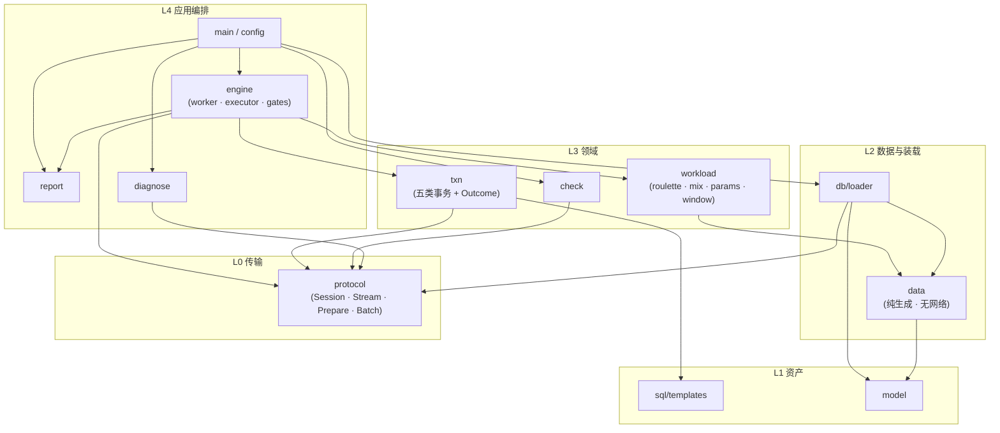
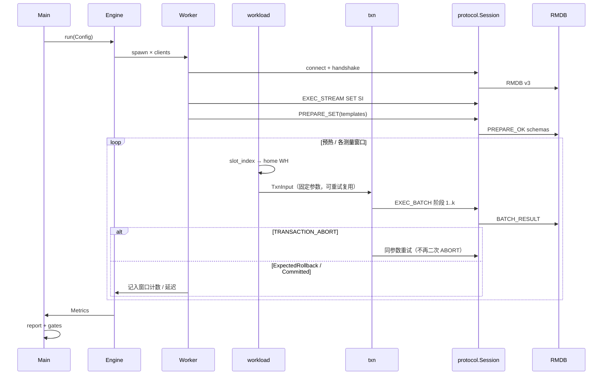
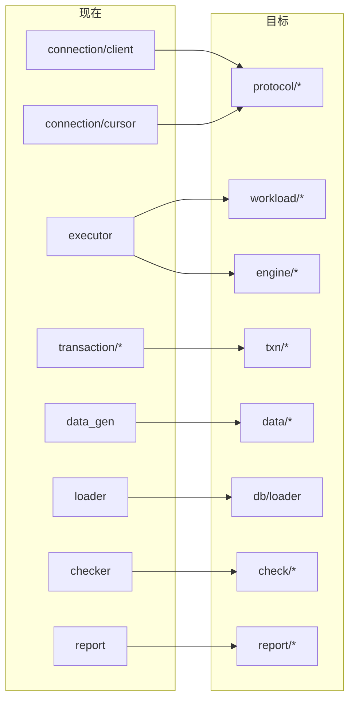

# TPCC-Tester 架构设计（2026 对齐目标）

本文描述将本仓库从 **2025 及以前文本协议客户端** 演进为 **2026 决赛兼容本地测评客户端子集** 时的模块化架构。实现跟踪见 Epic [#4](https://github.com/db-camp/TPCC-Tester/issues/4)；赛题规范见 `docs/2026年全国大学生计算机系统能力大赛数据库系统设计赛-决赛赛题.md`。

> **定位**：可本地运行的 2026 兼容客户端与自检工具，**不是**官方密封测评系统全量等价物（不透明标识符编排、隐藏 seed、48 隔离历史、COMMIT fsync 审计、strace 诊断等默认不在范围内）。

---

## 1. 设计原则

| 原则 | 含义 |
| --- | --- |
| **协议与业务分离** | Wire Protocol 不知道 NewOrder；事务不知道 TCP frame |
| **SQL 模板与执行分离** | 语句字典 / 模板集中管理；事务只组参数与读结果 |
| **负载与事务分离** | 轮盘 / 窗口 / 门禁在 workload；事务只消费 `TxnInput` |
| **生成与装载分离** | data 只产出 CSV / 行数账本；load 只发 DDL / LOAD |
| **校验只读依赖协议** | checker 不依赖 executor；benchmark 后可独立跑 |
| **依赖只向内 / 向下** | 上层可调下层，下层不 `use` 上层 |

---

## 2. 目标目录结构

```text
src/
├── main.rs                 # 仅 CLI 编排：解析 → 分发 mode
├── config.rs               # clap / 运行配置（无业务）
├── error.rs                # 统一错误类型
│
├── protocol/               # 【L0】Wire Protocol v3（可独立 crate 化）
│   ├── mod.rs
│   ├── handshake.rs        # RMDB major/minor
│   ├── frame.rs            # header + read_exact / write_all
│   ├── types.rs            # INT32 / FLOAT32 bits / CHAR / SqlValue
│   ├── exec_stream.rs      # META / ROW / RESULT_END / COMMAND_OK
│   ├── prepare.rs          # PREPARE_SET / PREPARE_OK
│   ├── batch.rs            # EXEC_BATCH / BATCH_RESULT / AUTO_ABORT
│   └── session.rs          # RmdbSession：一连接一 outstanding
│
├── sql/                    # 【L1】逻辑 SQL 资产（模板 + 静态文件）
│   ├── templates.rs        # 五类事务 $n 模板 + statement_id 表
│   ├── ddl.rs              # 或继续用仓库根 sql/*.sql
│   └── isolation.rs        # SET TRANSACTION ... 文本
│
├── model/                  # 【L1】表结构 / CSV 行 / ToCsvRow
│
├── data/                   # 【L2】数据生成（纯逻辑，无网络）
│   ├── gen.rs
│   ├── scale.rs            # 行数公式、精确 order_line 计数
│   └── rng_tpcc.rs         # NURand 等（可后续抽）
│
├── db/                     # 【L2】基于 Session 的装载 API
│   ├── loader.rs           # 建表 / 索引 / LOAD / COUNT
│   └── cursor_compat.rs    # 过渡期：旧 ? 拼接 → 逐步删除
│
├── txn/                    # 【L3】五类事务（Session + templates + input）
│   ├── mod.rs
│   ├── input.rs            # NewOrderInput 等（由 workload 生成）
│   ├── outcome.rs          # Committed / ExpectedRollback / RetryableAbort / Fatal
│   ├── new_order.rs
│   ├── payment.rs
│   ├── delivery.rs
│   ├── order_status.rs
│   └── stock_level.rs
│
├── workload/               # 【L3】负载与路由（不发 SQL）
│   ├── mix.rs              # 45/43/4/4/4
│   ├── roulette.rs         # 160 槽、热点仓、slot_index
│   ├── params.rs           # 从 slot 生成 TxnInput
│   └── window.rs           # 预热 / 多窗口时钟
│
├── engine/                 # 【L4】并发执行器
│   ├── worker.rs           # 每客户端：连 → SI → PREPARE → 循环
│   ├── executor.rs         # JoinSet、取消、进度
│   └── gates.rs            # 覆盖率 / 五类至少 1 笔 / Delivery 非空
│
├── check/                  # 【L3】一致性（只读查询）
│   ├── load_checks.rs
│   ├── online_checks.rs
│   └── stats.rs
│
├── report/                 # 【L4】指标与输出
│   ├── metrics.rs          # NewOrder/min、p50/p99、分类计数
│   └── print.rs
│
└── diagnose/               # 【L4】兼容性探测（可选）
    └── mod.rs
```

相对**当前**代码树的主要变化：

| 现在 | 目标 |
| --- | --- |
| `connection/` | `protocol/` |
| `executor.rs`（负载 + 执行混在一起） | `workload/` + `engine/` |
| `transaction/*` 内部 `rand` 抽仓 | `txn/*` 只消费 `TxnInput` |
| `checker.rs` / `loader.rs` 单文件 | `check/`、`db/` 模块 |
| 文本 SQL over TCP | Wire Protocol v3 + PREPARE/BATCH |

仓库根目录 `sql/create_tables.sql`、`sql/create_index.sql` 可继续作为 DDL 资产；运行时模板建议逐步迁入 `src` 侧 `sql/templates.rs` 以便与 `statement_id` 绑定。

---

## 3. 分层总图



**依赖方向：只允许箭头向下 / 向内。禁止 `protocol` 依赖 `txn`。**

---

## 4. 运行时：排名连接生命周期



理想无冲突 batch 往返数（赛题附件 A §7）：NewOrder 2、Payment 2、OrderStatus 3、Delivery 2–3、StockLevel 2。

---

## 5. 核心类型边界

### 5.1 事务输入 / 输出

```text
┌─────────────┐     ┌──────────────┐     ┌──────────────────┐
│  TxnInput   │────►│  txn::run    │────►│  TxnOutcome      │
│ (纯数据)     │     │  (async)     │     │ Committed        │
│ 由 workload  │     │ 只调 Session │     │ ExpectedRollback │
│ 生成且可 Clone│     │ + templates  │     │ RetryableAbort   │
└─────────────┘     └──────────────┘     │ Fatal / Abandoned │
                                         └──────────────────┘
```

- **Committed**：成功 COMMIT，计入对应事务成功提交（NewOrder 计入 `NewOrder/min` 分子）。
- **ExpectedRollback**：业务预期回滚（如 NewOrder 无效商品），可计入完成样本，**不**计入 NewOrder 成功提交。
- **RetryableAbort**：`TRANSACTION_ABORT` 等可重试冲突；复用同一 `TxnInput`，不增加 `txn_no`。
- **Fatal / Abandoned**：不可恢复或窗口截止放弃。

### 5.2 Session API（示意）

```text
protocol::Session
  ├── exec_stream(sql) -> StreamResult    // 装载 / 检查 / DDL
  ├── prepare_set(stmts) -> SchemaDict
  └── exec_batch(ops) -> BatchResult      // 排名路径

// 禁止 Session 内出现 TransactionType / 业务字段名逻辑
```

实现上建议尽早抽出 trait，便于单测：

```rust
// 示意，非最终 API
#[async_trait]
pub trait DbSession: Send {
    async fn exec_stream(&mut self, sql: &str) -> Result<StreamResult, TpccError>;
    async fn prepare_set(&mut self, stmts: &[PreparedStmt]) -> Result<SchemaDict, TpccError>;
    async fn exec_batch(&mut self, ops: &[BatchOp]) -> Result<BatchResult, TpccError>;
}
```

### 5.3 workload vs txn

| workload 职责 | txn 职责 |
| --- | --- |
| 选仓 / 热点 / 混合比 | 按 input 发 batch |
| 生成 input + 重试复用同一份 | 解释 BATCH 状态 → Outcome |
| 窗口起止时钟 | 不负责 `NewOrder/min` |
| **不发 SQL** | **不算**仓库覆盖率 |

改热点算法只动 `workload/`；改 NewOrder 锁序只动 `txn/new_order.rs`。

---

## 6. 模块职责一览

| 模块 | 职责 | 不负责 |
| --- | --- | --- |
| **protocol** | 字节契约、类型化编解码、连接状态机 | TPC-C 语义、统计 |
| **sql/templates** | `statement_id`、SQL 文本、参数类型表 | 随机参数 |
| **model / data** | 表结构、CSV、初始数据规模 | 网络、事务 |
| **db/loader** | 建表索引 LOAD、精确行数账本 | benchmark |
| **workload** | 轮盘、混合、窗口、`TxnInput` | Wire、COMMIT |
| **txn** | 五类事务 BATCH 边界与业务回滚 | 客户端数、中位数 |
| **engine** | 多连接、重试挂钩、取消 | 具体 SQL |
| **check** | 装载后 / 在线一致性 SQL | 杀进程（P3 另议） |
| **report** | `NewOrder/min`、p99、门禁展示 | 发请求 |
| **main** | mode 开关编排 | 业务细节 |

---

## 7. 与现状映射（增量迁移）



### 推荐落地顺序（与 Epic 子任务一致）

1. **P0** 新建 `protocol/`，`Session` 可与旧 `RmdbClient` 并行（config / feature 切换）→ Issues #5 #6 #7  
2. **P0/P1** 事务先可走 Stream，再挂 PREPARE 模板；StockLevel 语义优先对齐 → #8 #11 #12 #14  
3. 抽出 `workload::params`，事务签名改为 `execute(session, input)` → #9  
4. `executor` 改窗后迁入 `engine`；报告 `NewOrder/min` → #10  
5. 数据 / 索引 / 动态 order_line → #13  
6. **P2** `check` 扩展 + FLOAT32 bit pattern → #15 #16  
7. **P3** diagnose / 文档 / 可选崩溃模拟 → #17 #18 #19  

协作建议：**P0 合入后再并行认领 P1**；按 `area/*` 标签分工。

---

## 8. 配置与运行模式

```text
Config
  ├── conn: host, port
  ├── scale, csv_path
  ├── workload: clients, warmup, windows, seed, probs
  ├── protocol: legacy | v3
  └── gates: strict or not

Modes
  diagnose  → diagnose::run
  init      → db::loader
  check     → check::load / online
  benchmark → engine::run → report
```

`main` 保持瘦：

```text
parse → setup_tracing → match mode { ... } → exit code
```

正式规格默认值（本地可缩小）：50 仓、32 客户端、30s 预热、3×150s 窗口、事务比 45/43/4/4/4。详见赛题指标一览与 Issue #9。

---

## 9. 可测试性

| 层级 | 测试方式 |
| --- | --- |
| protocol | 假 TCP / 录制 frame 字节 fixture |
| workload | 纯函数：固定 seed → 仓分布直方图 |
| txn | mock `DbSession`，不断网 |
| check | 对结果集或 mock 断言 |
| engine | 小 clients + 可注入时钟窗口 |

---

## 10. 一句话边界

> **protocol 管字节，workload 管「测什么」，txn 管「怎么写库」，engine 管「多少人一起测」，report/check 管「算不算数」。**

按这五条边界拆分，Epic 中 P0–P2 可多人并行；旧文本协议可整层替换而不污染事务逻辑。

---

## 11. 相关链接

| 资源 | 链接 |
| --- | --- |
| Epic | https://github.com/db-camp/TPCC-Tester/issues/4 |
| 全部 2026 任务 | https://github.com/db-camp/TPCC-Tester/issues?q=label%3A2026-final |
| 赛题 | `docs/2026年全国大学生计算机系统能力大赛数据库系统设计赛-决赛赛题.md` |
| 协议 | 赛题附件 A《RMDB Wire Protocol》 |
| 当前实现入口 | `src/connection/`、`src/executor.rs`、`src/transaction/`、`src/checker.rs` |

---

*文档随实现演进更新；若目录 rename 已完成，请同步修订第 2、7 节映射表。*
